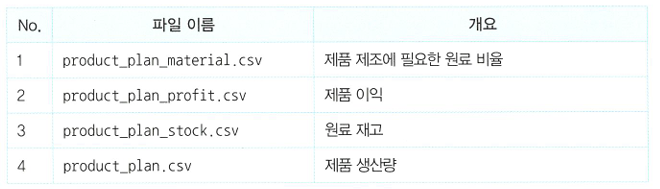

---
# Header
title: "1.나의 첫 머신러닝"
excerpt: "나의 첫 머신러닝"
name: J
writer: J
categories: [방학 ML 세션, 혼자 공부하는 머신러닝+딥러닝] # [메인 카테고리, 서브 카테고리]
tags:
  - [Khuda, ML, data]

toc: true
toc_sticky: true

date: 2024-07-30
last_modified_at: 2024-07-30

# --- 아래 부터 content
---

# 1-1. 인공지능과 머신러닝, 딥러닝
> 용어 설명
* 인공지능: 사람처럼 학습하고 추론할 수 있는 지능을 가진 컴퓨터 시스템을 만드는 기술<br>
* 머신러닝: 규칙을 일일이 프로그래밍하지 않아도 자동으로 데이터에서 규칙을 학습하는 알고리즘을 연구하는 분야(사이킷런)<br>
* 딥러닝: 많은 머신러닝 알고리즘 중에 인공 신경망을 기반으로 한 방법들(텐서플로, 파이토치)
* 모델: 머신러닝 프로그램에서 알고리즘이 구현된 객체

# 1-2. 코랩과 주피터 노트북
> 코랩


# 1-3. 마켓과 머신러닝
> 이진 분류란?
* 머신러닝에서 여러 개의 종류(혹은 클래스라고 부른다) 중 하나를 구별해 내는 문제를 **분류**라고 한다. 이 중 2개의 클래스 중 하나를 고르는 문제를 **이진 분류**라고 한다.<br>

> 실습1. 도미와 빙어 데이터 준비하기


* 특성: 데이터의 특징<br>


* 산점도: x, y축으로 이뤄진 좌표계에 두 변수(x, y)와 관계를 표현하는 방법

> 실습2. 첫 번째 머신러닝 프로그램
1. 데이터 합치기<br>

```js
    length = bream_length + smelt_length
    weight = bream_weight + smelt_weight
```
2. 2차원 배열로 만들기<br>
- 사이킷런을 이용하기 위해선 리스트를 세로로 늘어뜨린 2차원 리스트로 만들어야함.<br>

```js
    fish_data = [[l, w] for l, w in zip(length, weight)]
```

3. 정답 데이터 만들기<br>
- 도미: 1 / 빙어: 0<br>
```js
    fish_target = [1] * 35 + [0] * 14
    print(fish_target)
```

4. k-최근접 이웃 알고리즘
```js
    from sklearn.neighbors import KNeighborsClassifier
    kn = KNeighborsClassifier()
    kn.fit(fish_data, fish_target)
    kn.score(fish_data, fish_target)
    kn.predict([[30,600]])
```
- fit(): 훈련시킴
- score(): 모델의 정확도를 반환
- predict(): 새로운 데이터의 정답을 예측
<br>
<br>

> k-최근접 이웃 알고리즘

: 어떤 데이터에 대한 답을 구할 때 주위의 다른 데이터를 보고 다수를 차지하는 것을 정답으로 사용

- n_neighbors: 가까운 몇 개의 데이터를 참고할지 결정

> 핵심 패키지와 함수
- matplotlib
    - scatter(): 산점도를 그리는 함수
        - 처음 2개의 매개변수로 x축과 y축 값을 전달
        - c: 색깔 지정
        - marker: 마커 스타일 지정
- scikit-learn
    - KNeighborsClassifier(): k-최근접 이웃 분류 모델을 만듦
        - n_neighbors: 이웃의 개수 지정
        - p: 거리를 재는 방법 지정
        - n_jobs: CPU 코어를 지정
        - fit(): 훈련
        - predict(): 예측
        - score(): 성능 측정
