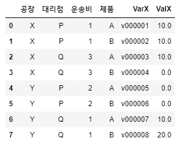
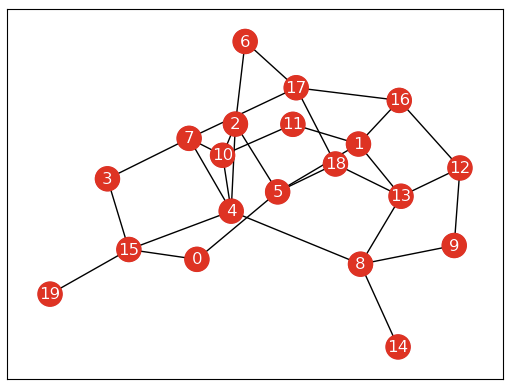

---
# Header
title: "2. 데이터 다루기"
excerpt: "데이터 다루기"
name: J
writer: J
categories: [방학 ML 세션, 혼자 공부하는 머신러닝+딥러닝] # [메인 카테고리, 서브 카테고리]
tags:
  - [Khuda, ML, data]

toc: true
toc_sticky: true

date: 2024-07-30
last_modified_at: 2024-07-30

# --- 아래 부터 content
---

# 2-1 훈련 세트와 테스트 세트
> 강화 학습: 타깃이 아니라 알고리즘이 행동한 결과로 얻은 보상을 사용해 학습

> 비지도 학습: 타깃 없이 입력 데이터만 이용/ 데이터 파악에 유용

> 지도 학습
: 훈련하기 위한 데이터와 정답 필요
- 데이터(입력) + 정답(타깃) = 훈련 데이터
- 특성: 입력으로 사용된 것

> 훈련 세트와 테스트 세트
- 테스트 세트: 평가에 사용하는 데이터
- 훈련 세트: 훈련에 사용되는 데이터

> 실습1
1. 리스트 준비

    - 샘플: 하나의 생선 데이터
2. 모델 객체 만들기

    - 샘플링 편향: 훈련 세트와 테스트 세트에 샘플이 골고루 섞여 있지 않은 현상(훈련 세트에 도미만 있으니 정확도가 0!)

> 실습2(정확도 상승)
- 넘파이: 배열 라이브러리 
1. 2차원으로 만들기

    - shape: 배열의 크기 알려줌.  
2. 섞기
  
3. 산점도 그리기
  
4. 학습

> 넘파이
- seed(): 난수를 생성하기 위한 정수 초깃값. 초깃값이 같으면 동일한 난수를 뽑는다.
- arange(): 일정한 간격의 정수 또는 실수 배열을 만든다.
    - 매개변수 1개: 종료 숫자
    - 매개변수 2개: 시작 숫자, 종료 숫자
    - 매개변수 3개: 마지막 매개변수가 간격
- shuffle(): 주어진 배열을 랜덤하게 섞는다.

# 2-2 데이터 전처리
> 넘파이로 데이터 준비하기

- column_stack(): 전달받은 리스트를 일렬로 세운 다음 차례대로 나란히 연결한다.  

- np.column_stack() vs np.concatenate()
      

> 사이킷런으로 훈련 세트와 테스트 세트 나누기

- train_test_split(): 전달되는 리스트나 배열을 비율에 맞게 훈련 세트와 테스트 세트로 나누어 준다. 나누기 전에 섞어 준다.

- stratify 매개변수: 클래스의 비율을 맞춰줌.

> 수상한 도미 한마리

#### (25,150)은 도미에 가까운데 왜 빙어로 판단을 할까?

> 기준을 맞추자

- x축과 y축의 범위의 차이가 너무 커서 y값이 거리에 너무 영향을 많이 준다! -> x축의 범위를 동일하게 0 ~ 1000으로 맞추자.
