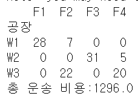
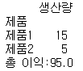
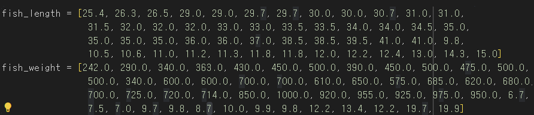
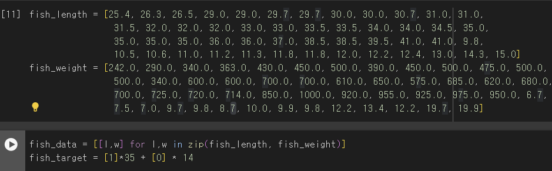
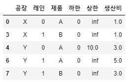

---
# Header
title: "7.물류 네트워크 최적 설계를 위한 테크닉 10"
excerpt: "물류 네트워크 최적 설계를 위한 테크닉 10"
name: J
writer: J
categories: [데비&추천시스템, 파이썬 데이터분석 실무 테크닉 100] # [메인 카테고리, 서브 카테고리]
tags:
  - [Khuda, ML, data]

toc: true
toc_sticky: true

date: 2024-10-08
last_modified_at: 2024-10-08

# --- 아래 부터 content
---

🔖전제조건

- 이 기업이 다루는 물류의 전체 모습


- 최종적으로 제품을 판매하는 대리점 (P, Q)이 있고 거기에 판매되는 상품군(제품 A, B)에는 일정 수요가 예측되어 있음<br>
-> 공장(공장 X, Y)에서의 생산량을 결정
- 각 공장에서 대리점으로까지의 운송비, 제고 비용 등 -> 제품을 어느 공장의 어느 생산라인(레인 0, 1)에서 조합할지 결정

# 061. 운송 최적화 문제를 풀어보자

- pulp: 최적화 모델을 작성(라이브러리)
- ortoolpy: 목적함수를 생성해서 최적화 문제를 푸는 (라이브러리)

### 운송 최적화 문제

```py
import numpy as np
import pandas as pd
from itertools import product
%pip install pulp
from pulp import LpVariable, lpSum, value
%pip install ortoolpy
from ortoolpy import model_min, addvars, addvals

# 데이터 불러오기
df_tc = pd.read_csv('trans_cost.csv', index_col="공장")
df_demand = pd.read_csv('demand.csv')
df_supply = pd.read_csv('supply.csv')

# 초기 설정  #
np.random.seed(1)
nw = len(df_tc.index)
# 공장 갯수
nf = len(df_tc.columns)
# 창고 갯수
pr = list(product(range(nw), range(nf)))
# roduct(A, B) 는 ((x, y) for x in A for y in B) 와 같은 결과를 반환합니다.
# 결과값은 어떤 공장과 어떤 창고의 쌍

# 수리 모델 작성  #
m1 = model_min()
# '최소화를 실행하는' 모델 정의 -> 이제부터 정의하는 목적함수를 제약 조건 하에서 최소화할 수 있다.
v1 = {(i,j):LpVariable('v%d_%d'%(i,j),lowBound=0) for i,j in pr}
# 공장과 창고의 쌍

m1 += lpSum(df_tc.iloc[i][j]*v1[i,j] for i,j in pr)
# 목적함수 ml을 lpSum을 이용해 정의
# df_tc.iloc[i][j]: 공장 i에서 창고 j까지 가는데 드는 비용
# lpSum: 배열을 인자로 받으며 배열의 모든 원소를 덧셈으로 연결한 식을 반환
# 이때 m1에 더한것: 10*v0_0 + 10*v0_1 + 11*v0_2 + 27*v0_3 + 18*v1_0 + 21*v1_1 + 12*v1_2 + 14*v1_3 + 15*v2_0 + 12*v2_1 + 14*v2_2 + 12*v2_3 + 0

for i in range(nw):
    # nw: 3
    m1 += lpSum(v1[i,j] for j in range(nf)) <= df_supply.iloc[0][i]
    # df_supply:창고의 공급량
    # 각 창고가 제공할 부품이 제공한계를 넘지 않도록
for j in range(nf):
    # nf: 4
    m1 += lpSum(v1[i,j] for i in range(nw)) >= df_demand.iloc[0][j]
    # df_demand: 공장의 수요
    # 공장이 제조할 제품 수요량을 만족시키도록
m1.solve()
# 변수 v1이 최적화되고 최적의 총 운송 비용이 구해집니다.

# 총 운송 비용 계산#
df_tr_sol = df_tc.copy()
total_cost = 0
for k,x in v1.items():
    # v1.items(): dict_items([((0, 0), v0_0), ((0, 1), v0_1), ((0, 2), v0_2), ((0, 3), v0_3), ((1, 0), v1_0), ((1, 1), v1_1), ((1, 2), v1_2), ((1, 3), v1_3), ((2, 0), v2_0), ((2, 1), v2_1), ((2, 2), v2_2), ((2, 3), v2_3)])
    i,j = k[0],k[1]
    # i: 창고 / k: 공장
    df_tr_sol.iloc[i][j] = value(x)
    # value(x)를 print()해보면 각 공장과 창고간의 운송량 나옴.
    total_cost += df_tc.iloc[i][j]*value(x)
    # 운송량 * 운송 비용 = 총 운송 비용
print(df_tr_sol)
print("총 운송 비용:"+str(total_cost))
```



# 062. 최적 운송 경로를 네트워크로 확인하자

```py
import pandas as pd
import numpy as np
import matplotlib.pyplot as plt
import networkx as nx

# 데이터 불러오기
df_tr = df_tr_sol.copy()
df_pos = pd.read_csv('trans_route_pos.csv')

# 객체 생성
G = nx.Graph()

# 노드 설정
for i in range(len(df_pos.columns)):
    # df_pos.columns: 각 열 이름들 list로 만들기
    G.add_node(df_pos.columns[i])

# 엣지 설정 & 엣지의 가중치 리스트화
num_pre = 0
edge_weights = []
size = 0.1
for i in range(len(df_pos.columns)):
    # i -> 0 ~ 6(7번)
    for j in range(len(df_pos.columns)):
        # 7번
        if not (i==j):
            # 엣지 추가
            G.add_edge(df_pos.columns[i],df_pos.columns[j])
            # 엣지 가중치 추가
            # df_pos.columns: Index(['W1', 'W2', 'W3', 'F1', 'F2', 'F3', 'F4'], dtype='object')
            if num_pre<len(G.edges):
                num_pre = len(G.edges)
                weight = 0
                if (df_pos.columns[i] in df_tr.columns)and(df_pos.columns[j] in df_tr.index):
                    # i가 공장이고 j가 창고인 경우
                    if df_tr[df_pos.columns[i]][df_pos.columns[j]]:
                        weight = df_tr[df_pos.columns[i]][df_pos.columns[j]]*size
                elif(df_pos.columns[j] in df_tr.columns)and(df_pos.columns[i] in df_tr.index):
                    # i가 창고고 j가 공장인 경우
                    if df_tr[df_pos.columns[j]][df_pos.columns[i]]:
                        weight = df_tr[df_pos.columns[j]][df_pos.columns[i]]*size
                edge_weights.append(weight)
                

# 좌표 설정
pos = {}
for i in range(len(df_pos.columns)):
    node = df_pos.columns[i]
    pos[node] = (df_pos[node][0],df_pos[node][1])
    
# 그리기
nx.draw(G, pos, with_labels=True,font_size=16, node_size = 1000, node_color='k', font_color='w', width=edge_weights)

# 표시
plt.show()
```


# 063. 최적 운송 경로가 제약 조건을 만족하는지 확인하자

```py
import pandas as pd
import numpy as np

# 데이터 불러오기
df_demand = pd.read_csv('demand.csv')
df_supply = pd.read_csv('supply.csv')

# 제약조건 계산함수
# 수요측
def condition_demand(df_tr,df_demand):
    flag = np.zeros(len(df_demand.columns))
    # 공장 측 수요
    for i in range(len(df_demand.columns)):
        temp_sum = sum(df_tr[df_demand.columns[i]])
        # i 공장에 가는 양
        if (temp_sum>=df_demand.iloc[0][i]):
            flag[i] = 1
    return flag
            
# 공급측
def condition_supply(df_tr,df_supply):
    flag = np.zeros(len(df_supply.columns))
    # 창고 측 공급
    for i in range(len(df_supply.columns)):
        temp_sum = sum(df_tr.loc[df_supply.columns[i]])
        # 창고가 공급할 총 양
        if temp_sum<=df_supply.iloc[0][i]:
            flag[i] = 1
    return flag

print("수요 조건 계산 결과:"+str(condition_demand(df_tr_sol,df_demand)))
print("공급 조건 계산 결과:"+str(condition_supply(df_tr_sol,df_supply)))
```

# 064. 생산 계획 데이터를 불러오자

### 데이터 정보


### 생산 계획 데이터 불러오기


```py
import pandas as pd

df_material = pd.read_csv('product_plan_material.csv', index_col="제품")
print(df_material)
df_profit = pd.read_csv('product_plan_profit.csv', index_col="제품")
print(df_profit)
df_stock = pd.read_csv('product_plan_stock.csv', index_col="항목")
print(df_stock)
df_plan = pd.read_csv('product_plan.csv', index_col="제품")
print(df_plan)
```


- product_plan_material: 생산하는 두 종류의 제품과 그것들을 제조하는데 필요한 3종류의 원료의 비율이 저장됨.
- product_plan_profit: 각 제품의 이익이 저장됨.
- product_plan: 제품의 생산량이 저장됨.

# 065. 이익을 계산하는 함수를 만들자

```py
# 이익 계산 함수
def product_plan(df_profit,df_plan):
    profit = 0
    for i in range(len(df_profit.index)):
        # 제품 갯수: i(2)
        for j in range(len(df_plan.columns)):
            # df_plan.columns : 1
            profit += df_profit.iloc[i][j]*df_plan.iloc[i][j]
            # 제품의 이익 * 제품의 생산량
    return profit

print("총 이익:"+str(product_plan(df_profit,df_plan)))
```

# 066. 생산 최적화 문제를 풀어보자

```py
import pandas as pd
from pulp import LpVariable, lpSum, value
from ortoolpy import model_max, addvars, addvals


df = df_material.copy()
# 각 제품당 각 원료가 얼마나 들어가는지 저장.
inv = df_stock
# 상품의 재고 저장

m = model_max()
v1 = {(i):LpVariable('v%d'%(i),lowBound=0) for i in range(len(df_profit))}
# 변수 만들기
# len(df_profit) : 상품의 갯수

m += lpSum(df_profit.iloc[i]*v1[i] for i in range(len(df_profit)))
# 상품의 이득 * x(제품수) 의 최대화
for i in range(len(df_material.columns)):
    # i: 원재료의 갯수
    m += lpSum(df_material.iloc[j,i]*v1[j] for j in range(len(df_profit)) ) <= df_stock.iloc[:,i]
    # 상품에 대해 해당 원재료가 필요한 것들의 합이 원재료의 재고보다 작거나 같아야함.

m.solve()

df_plan_sol = df_plan.copy()
for k,x in v1.items():
    df_plan_sol.iloc[k] = value(x)
print(df_plan_sol)
print("총 이익:"+str(value(m.objective)))
```


# 067. 최적 생산 계획이 제약 조건을 만족하는지 확인하자

❗최적화 문제를 풀 때 가장 주의할 점은 최적화 계산을 한 결과를 이해하지 않고 그냥 받아들이면 안 된다는 것이다.

```py
# 제약 조건 계산 함수
def condition_stock(df_plan,df_material,df_stock):
    flag = np.zeros(len(df_material.columns))
    # 원재료 갯수 만큼 0 list 생성
    for i in range(len(df_material.columns)):  
        # i: 0~2
        temp_sum = 0
        for j in range(len(df_material.index)):  
            # j: 0~1
            temp_sum = temp_sum + df_material.iloc[j][i]*float(df_plan.iloc[j])
            # temp_sum: 상품별로 원재료 i가 얼마나 이용되는지를 다 더한 값.
        if (temp_sum<=float(df_stock.iloc[0][i])):
            flag[i] = 1
        print(df_material.columns[i]+"  사용량:"+str(temp_sum)+", 재고:"+str(float(df_stock.iloc[0][i])))
    return flag

print("제약 조건 계산 결과:"+str(condition_stock(df_plan_sol,df_material,df_stock)))
```

# 068. 물류 네트워크 설계 문제를 풀어보자

❗실제: 운송 경로 최적화 + 생산 계획 최적화

- 물류 네트워크:
    - 제품을 판매하는 대리점 (P, Q)
        - 상품군 (제품 A, B) 판매 -> 일정 수요가 예측
    - 공장(X, Y)
        - 대리점의 상품군들의 수요를 근거로 생산량 결정
    - 생산라인 (레인 0, 1)
        - 각 제품을 어느 공장의 어떤 생산라인에서 제조할지는 각 공장에서 대리점까지의 운송 비용 및 제조 비용 등을 고려해서 결정


⭐운송 비용과 제조 비용이 수요를 만족하면서 최소가 되도록!<br>
=> 목적함수: 운송 비용 + 제조 비용 / 제약 조건: 각 대리점의 판매 수가 수요 수를 넘는 것.

```py
import numpy as np
import pandas as pd

제품 = list('AB')
# ['A', 'B']
대리점 = list('PQ')
공장 = list('XY')
레인 = (2,2)

# 운송비 #
tbdi = pd.DataFrame(((j,k) for j in 대리점 for k in 공장), columns=['대리점','공장'])
tbdi['운송비'] = [1,2,3,1]
print(tbdi)

# 수요 #
tbde = pd.DataFrame(((j,i) for j in 대리점 for i in 제품), columns=['대리점','제품'])
tbde['수요'] = [10,10,20,20]
print(tbde)

# 생산 #
tbfa = pd.DataFrame(((k,l,i,0,np.inf) for k,nl in zip (공장,레인) for l in range(nl) for i in 제품), 
                    columns=['공장','레인','제품','하한','상한'])
tbfa['생산비'] = [1,np.nan,np.nan,1,3,np.nan,5,3]
tbfa.dropna(inplace=True)
tbfa.loc[4,'상한']=10
print(tbfa)

from ortoolpy import logistics_network
_, tbdi2, _ = logistics_network(tbde, tbdi, tbfa,dep = "대리점", dem = "수요",fac = "공장", prd = "제품",tcs = "운송비",pcs = "생산비",lwb = "하한",upb = "상한")

print(tbfa)
print(tbdi2)
```


- ValY: 최적 생산량 / ValX: 최적 운송량

➕ ortoolpy.logistics_network 설명

- input: 순서대로 df1, df2, df3가 필요
    - df1: 수요지(제품을 운송받을 판매처), 제품, 수요 3개의 정보를 담은 dataframe
    - df2: 수요지, 공장, 운송비 3개의 정보를 담은 dataframe
    - df3: 공장, 제품, 생산비 3개의 정보를 담은 dataframe (+ 하한, 상한 정보는 optional)
    - dep, dem, fac, prd, tcs, pcs, lwb, upb 변수에 각각 해당되는 컬럼명을 대응시켜줌
- output:
    - 해의 유무 (계산이 잘 되었는지), 운송표 (운송량이 계산된 dataframe), 생산표(생산량이 계산된 dataframe)
        - 해의 유무: 계산이 가능하면 True를 return
        - 운송표: df1, df2를 바탕으로 계산된 새로운 dataframe
        - 생산표: df3에 계산값이 추가된 것 (생산표는 df3 자체가 변형되므로 별도로 받아서 저장할 필요X)

❓ dep, dem등은 갑자기 어디서 나오는걸까?<br>
❓무슨 기준으로 어떤 항목을 최적으로 계산하는 걸까?

# 069. 최적 네트워크의 운송 비용과 그 내역을 계산하자

```py
tbdi2 = tbdi2[["공장","대리점","운송비","제품","VarX","ValX"]]
tbdi2
```


```py
trans_cost = 0
for i in range(len(tbdi2.index)):
    trans_cost += tbdi2["운송비"].iloc[i]*tbdi2["ValX"].iloc[i]
print("총 운송비:"+str(trans_cost))
# 80만원
```

# 070. 최적 네트워크의 생산 비용과 그 내역을 계산하자

```py
tbfa
```


```py
product_cost = 0
for i in range(len(tbfa.index)):
    product_cost += tbfa["생산비"].iloc[i]*tbfa["ValY"].iloc[i]
print("총 생산비:"+str(product_cost))
# 120만원
```