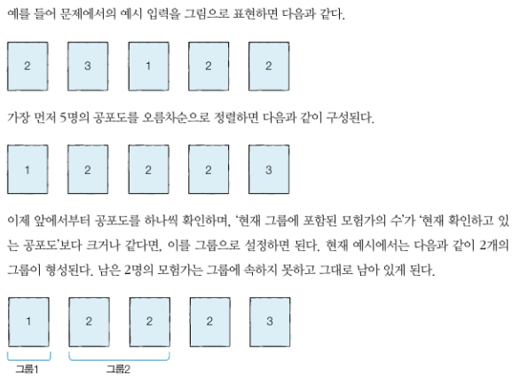

---
# Header
title: "9.잠재고객을 파악하기 위한 이미지 인식 테크닉 10"
excerpt: "잠재고객을 파악하기 위한 이미지 인식 테크닉 10"
name: J
writer: J
categories: [데비&추천시스템, 파이썬 데이터분석 실무 테크닉 100] # [메인 카테고리, 서브 카테고리]
tags:
  - [Khuda, ML, data]

toc: true
toc_sticky: true

date: 2024-10-29
last_modified_at: 2024-10-29

# --- 아래 부터 content
---
⭐OpenCV 이용

🔖전제조건
- 대리점 앞 도로의 동영상/이미지를 다룸.
    - mov 폴더: 동영상
    - img 폴더: 이미지
    - snapshot 폴더(빈 폴더): 동영상을 이미지화한 것(스냅숏)


# 081.이미지 데이터를 불러오자

```py
from google.colab.patches import cv2_imshow
!curl -o logo.png https://colab.research.google.com/img/colab_favicon_256px.png
import cv2
# 파이썬 라이브러리 불러옴
img = cv2.imread("/content/drive/MyDrive/쿠다/쿠다 6기/9장/img/img01.jpg", cv2.IMREAD_UNCHANGED)
height, width = img.shape[:2]
# 3차원 (a,b,c) -> a와 b만 추출
print("이미지 가로: " + str(width))
print("이미지 세로: " + str(height))
# 이미지 가로: 1920
# 이미지 세로: 1440
cv2_imshow(img)
# 이미지 가져오기
cv2.waitKey(0)
# 몇 초 동안 이미지를 표시할지를 밀리초 단위로 지정(윈도우를 닫을때까지 계속해서 보여줄 경우에는 0으로 지정)
cv2.destroyAllWindows()
```


# 082. 동영상 데이터를 불러오자
```py
import cv2

# 정보 취득 #
cap = cv2.VideoCapture("/content/drive/MyDrive/쿠다/쿠다 6기/9장/mov/mov01.avi")
width = cap.get(cv2.CAP_PROP_FRAME_WIDTH)
height = cap.get(cv2.CAP_PROP_FRAME_HEIGHT)
count = cap.get(cv2.CAP_PROP_FRAME_COUNT)
fps = cap.get(cv2.CAP_PROP_FPS)
print("가로: " + str(width))
print("세로: " + str(height))
print("총 프레임수: " + str(count))
print("FPS: " + str(fps))
#가로: 1920.0
#세로: 1440.0
#총 프레임수: 401.0
#FPS: 30.0 -> 비디오의 초당 프레임 수

# 출력 #
while(cap.isOpened()):  # 비디오 파일이 열려 있는 동안 반복
    ret, frame = cap.read()  
    # 현재 프레임을 읽기. 성공하면 ret=True와 해당 프레임을 반환
    if ret:  # 프레임을 성공적으로 읽은 경우
        cv2_imshow(frame)  # Google Colab에서 프레임을 화면에 표시
    if cv2.waitKey(1) & 0xFF == ord("q"):  # 사용자가 'q' 키를 누르면 반복 종료
        break
cap.release()  # 비디오 캡처 자원 해제
cv2.destroyAllWindows()  # 모든 창 닫기
```

# 083.동영상을 이미지로 나누고 저장하자

```py
import cv2
cap = cv2.VideoCapture("/content/drive/MyDrive/쿠다/쿠다 6기/9장/mov/mov01.avi")
num = 0
while(cap.isOpened()):
    ret, frame = cap.read()
    # cap.read()로 비디오의 다음 프레임을 읽어옵니다
    if ret:
        cv2_imshow(frame)
        filepath = "snapshot/snapshot_" + str(num) + ".jpg"
        cv2.imwrite(filepath,frame)
        # cv2.imwrite(filepath, frame)는 현재 프레임을 filepath 위치에 이미지 파일로 저장합니다
        if cv2.waitKey(1) & 0xFF == ord('q'):
            break
    num = num + 1
cap.release()
# cap.release()는 비디오 캡처 객체를 해제하여 비디오 파일을 닫습니다.
cv2.destroyAllWindows()
```


# 084.이미지 속에 사람이 어디에 있는지 검출해 보자

사람을 인식하기 위해서는 'HOG 특징량'

- Hog?: 휘도(빛의 단위 중 하나)의 기울기(사람 실루엣 형태의 특징을 위치나 각도로 표현한 것)


```py
import cv2

# 준비 #
hog = cv2.HOGDescriptor()
#  HOG 객체를 초기화
hog.setSVMDetector(cv2.HOGDescriptor_getDefaultPeopleDetector())
# SVM 모델을 사용하여 HOG 기반의 사람 검출기를 설정합니다. 이는 OpenCV에 내장된 기본 사람 검출기를 사용하는 방식
hogParams = {'winStride': (8, 8), 'padding': (32, 32), 'scale': 1.05, 'hitThreshold':0, 'finalThreshold':5}
# hogParams 변수는 검출기의 매개변수를 설정

# 검출 #
img = cv2.imread("/content/drive/MyDrive/쿠다/쿠다 6기/9장/img/img01.jpg")
gray = cv2.cvtColor(img, cv2.COLOR_BGR2GRAY)
# 이미지를 그레이스케일로 변환하여 처리 속도를 높이고, HOG의 사람 검출에 적합하도록 만듭니다.
human, r = hog.detectMultiScale(gray)
# 사람을 검출하는 함수로, human은 검출된 사람의 위치와 크기(사각형 좌표) 정보를 리스트로 반환합니다.
if (len(human)>0):
    for (x, y, w, h) in human:
        cv2.rectangle(img, (x, y), (x + w, y + h), (255,255,255), 3)
    #  검출된 영역의 좌표와 크기를 순회하며, cv2.rectangle 함수로 사각형을 그려 검출된 사람을 시각적으로 표시합니다. 255, 255, 255는 흰색, 3은 사각형의 두께입니다.

cv2_imshow(img)
cv2.imwrite("temp.jpg",img)
cv2.waitKey(0)
cv2.destroyAllWindows()
```


### hogParams 검출기의 매개변수

🔖winStride: (8, 8)

- winStride는 탐지 윈도우가 이동하는 보폭(stride)을 지정합니다. (8, 8)로 설정하면 가로와 세로 방향으로 8픽셀씩 이동하며 검출을 수행합니다.
- 보폭이 작을수록 검출 정확도가 높아지지만, 처리 시간이 증가합니다. 반대로 보폭을 크게 설정하면 검출이 더 빠르지만 작은 물체를 놓칠 수 있습니다.

🔖padding: (32, 32)

- padding은 각 탐지 윈도우 주변에 추가하는 여백을 의미합니다. (32, 32)로 설정하면 윈도우가 이동할 때 주변에 32픽셀의 여유 공간이 생깁니다.
- 검출기의 성능과 정확도를 높이기 위해서 필요한 경우 padding을 설정할 수 있습니다. 여백이 충분할수록 배경과의 구분이 더 잘 이루어져 인식이 정확해질 수 있습니다.

🔖scale: 1.05

- scale은 이미지 피라미드를 사용할 때 각 단계의 축소 비율을 지정합니다. 1.05로 설정하면 탐지 윈도우의 크기를 약 5%씩 줄여가며 작은 객체까지 탐지할 수 있게 됩니다.
- scale이 작을수록 더 많은 객체를 탐지할 수 있지만 처리 시간이 증가하며, 너무 크게 설정하면 작은 객체를 놓칠 수 있습니다.

🔖hitThreshold: 0

- hitThreshold는 검출기 신뢰도를 설정하는 임계값입니다. 값이 낮을수록 더 많은 객체가 탐지되지만, 잘못된 검출(오탐지)도 많아질 수 있습니다.
- 보통 0으로 두어 검출 가능성을 높이지만, 오탐지가 많을 경우 값을 높여 정확도를 조절할 수 있습니다.

# 085.이미지 속 사람 얼굴을 검출해 보자

전통적으로 CascadeClassifier를 이용

```py
import cv2

# 준비
cascade_file = "/content/drive/MyDrive/쿠다/쿠다 6기/9장/haarcascade_frontalface_alt.xml"
# Haar Cascade 분류기를 초기화합니다. 이 파일은 사전 학습된 얼굴 검출 모델이며, OpenCV에서 제공하는 기본 얼굴 인식 모델
cascade = cv2.CascadeClassifier(cascade_file)
# 얼굴 검출을 위한 분류기 객체를 생성

# 검출
img = cv2.imread("/content/drive/MyDrive/쿠다/쿠다 6기/9장/img/img02.jpg")
gray = cv2.cvtColor(img, cv2.COLOR_BGR2GRAY)
face_list = cascade.detectMultiScale(gray, minSize=(50, 50))
# detectMultiScale 함수를 통해 얼굴을 검출하고, 검출된 얼굴의 위치와 크기를 (x, y, w, h) 형태로 반환
# minSize=(50, 50)는 최소 얼굴 크기를 지정합니다. 즉, 50x50 픽셀 이상의 영역만을 얼굴로 검출

# 검출한 얼굴 표시하기
for (x, y, w, h) in face_list:
    color = (0, 0, 225)
    pen_w = 3
    # pen_w = 3는 사각형의 테두리 두께를 설정합니다.
    cv2.rectangle(img, (x, y), (x+w, y+h), color, thickness = pen_w)

cv2_imshow(img)
cv2.imwrite("temp.jpg",img)
cv2.waitKey(0)
cv2.destroyAllWindows()
```


# 086.이미지 속 사람의 얼굴이 어느 쪽을 보고 있는지 검출해 보자

dlib이라는 라이브러리를 이용하면 얼굴을 얼굴 랜드마크라고 부르는 눈,코,입,윤곽의 68개 특징점으로 표현할 수 있음 -> 세세한 정보 검출

```py
import cv2
import dlib
import math

# 준비 #
predictor = dlib.shape_predictor("/content/drive/MyDrive/쿠다/쿠다 6기/9장/shape_predictor_68_face_landmarks.dat")
# predictor는 사전 학습된 shape_predictor_68_face_landmarks.dat 파일을 사용하여 68개의 얼굴 랜드마크를 검출하는 도구입니다.
detector = dlib.get_frontal_face_detector()
# dlib의 기본 얼굴 검출기를 초기화합니다

# 검출 #
img = cv2.imread("/content/drive/MyDrive/쿠다/쿠다 6기/9장/img/img02.jpg")
dets = detector(img, 1)
# detector를 사용해 얼굴을 검출합니다. dets는 얼굴의 위치를 포함한 사각형 객체 리스트

for k, d in enumerate(dets):
    # index(k):0 / d: [(1061, 116) (1216, 270)]
    shape = predictor(img, d)
    # predictor를 사용해 각 얼굴의 랜드마크를 계산하고, shape 객체에 저장합니다.

    # 얼굴 영역 표시
    color_f = (0, 0, 225) # 빨
    color_l_out = (255, 0, 0) # 파
    color_l_in = (0, 255, 0) # 초
    line_w = 3
    circle_r = 3
    fontType = cv2.FONT_HERSHEY_SIMPLEX
    fontSize = 1
    # 얼굴 테두리와 랜드마크를 표시할 색상과 선 두께를 설정합니다.
    cv2.rectangle(img, (d.left(), d.top()), (d.right(), d.bottom()), color_f, line_w)
    cv2.putText(img, str(k), (d.left(), d.top()), fontType, fontSize, color_f, line_w)
    # 얼굴 영역을 빨간색 사각형으로 표시하고, 각 얼굴에 번호를 붙입니다.

    # 중심을 계산할 사각형 준비
    num_of_points_out = 17
    num_of_points_in = shape.num_parts - num_of_points_out
    # shape.num_parts 하면 전체 랜드마크 수
    # num_of_points_out는 얼굴 외곽부에 해당하는 17개 랜드마크를 의미하며, 나머지 51개는 얼굴 내부 랜드마크로 간주
    gx_out = 0
    gy_out = 0
    gx_in = 0
    gy_in = 0
    # gx_out, gy_out는 외곽부의 중심 좌표이고, gx_in, gy_in은 얼굴 내부의 중심 좌표
    for shape_point_count in range(shape.num_parts):
        shape_point = shape.part(shape_point_count)
        #print("얼굴 랜드마크No.{} 좌표 위치: ({},{})".format(shape_point_count, shape_point.x, shape_point.y))
        #얼굴 랜드마크마다 그리기
        if shape_point_count<num_of_points_out:
            # 외곽
            cv2.circle(img,(shape_point.x, shape_point.y),circle_r,color_l_out, line_w)
            gx_out = gx_out + shape_point.x/num_of_points_out
            gy_out = gy_out + shape_point.y/num_of_points_out
        else:
            # 내부
            cv2.circle(img,(shape_point.x, shape_point.y),circle_r,color_l_in, line_w)
            gx_in = gx_in + shape_point.x/num_of_points_in
            gy_in = gy_in + shape_point.y/num_of_points_in
        # 모든 랜드마크에 대해 반복문을 돌며 외곽 랜드마크는 파란색, 내부 랜드마크는 초록색으로 점을 그립니다.
        # 외곽과 내부 각각의 중심을 구하기 위해 각 랜드마크 좌표의 평균을 계산합니다.

    # 중심 위치 표시
    cv2.circle(img,(int(gx_out), int(gy_out)),circle_r,(0,0,255), line_w)
    # 외부-> 빨간색
    cv2.circle(img,(int(gx_in), int(gy_in)),circle_r,(0,0,0), line_w)
    # 내부 -> 검정색
    # 외곽과 내부의 중심을 빨간색과 검은색 원으로 표시합니다.

    # 얼굴 방향 계산
    theta = math.asin(2*(gx_in-gx_out)/(d.right()-d.left()))
    radian = theta*180/math.pi
    print("얼굴 방향:{} (각도:{}도)".format(theta,radian))
    # 얼굴 방향:0.06253283992253719 (각도:3.582867808528563도)
    # asin: 사인 값을 각도로 변환
    # 얼굴의 방향을 asin을 사용해 계산합니다. gx_in - gx_out으로 얼굴의 기울어진 정도를 구하고, 전체 얼굴 너비로 나누어 각도를 구합니다. 각도를 라디안과 도 단위로 출력합니다.
    # d.right() - d.left()는 얼굴 전체의 가로 길이
    # **2 * (gx_in - gx_out) / (d.right() - d.left())**는 얼굴이 좌우로 얼마나 기울어졌는지를 0과 1 사이의 비율로 계산합니다. 이 값이 -1에 가까울수록 왼쪽으로, 1에 가까울수록 오른쪽으로 많이 기울어진 것입니다.

    # 얼굴 방향 표시
    if radian<0:
        textPrefix = "   left "
    else:
        textPrefix = "   right "
    textShow = textPrefix + str(round(abs(radian),1)) + " deg."
    cv2.putText(img, textShow, (d.left(), d.top()), fontType, fontSize, color_f, line_w)


cv2_imshow(img)
cv2.imwrite("temp.jpg",img)
cv2.waitKey(0)
cv2.destroyAllWindows()
```

# 087.검출한 정보를 종합해서 타입랩스를 만들어보자

- 타임랩스: 일정 기간의 프레임 중에서 1프레임만 꺼내는 "빠르게 재생하기"임.

```py
import cv2

print("타임랩스 생성 시작")

# 동영상 읽어오기 #
cap = cv2.VideoCapture("mov/mov01.avi")
width = int(cap.get(cv2.CAP_PROP_FRAME_WIDTH)) #가로
height = int(cap.get(cv2.CAP_PROP_FRAME_HEIGHT)) #세로

# hog 선언 #
hog = cv2.HOGDescriptor() 
#  HOG 기반의 사람 검출기를 설정합니다.
hog.setSVMDetector(cv2.HOGDescriptor_getDefaultPeopleDetector())
hogParams = {'winStride': (8, 8), 'padding': (32, 32), 'scale': 1.05, 'hitThreshold':0, 'finalThreshold':5}
# detectMultiScale에 전달할 매개변수 -> 사람 검출 시 윈도우의 이동 보폭, 패딩, 스케일 등을 설정합니다.
# finalThreshold:  여러 단계의 검출기를 통과한 후 최종적으로 객체로 인식될 때 필요한 최소 통과 단계 수를 설정하는 임계값

# 타임랩스 작성 #
movie_name = "timelapse.avi"
fourcc = cv2.VideoWriter_fourcc('X', 'V', 'I', 'D')
# fourcc는 비디오 코덱을 설정하며, 여기서는 'XVID' 코덱(음성 또는 영상의 신호를 디지털 신호로 변환하는 코더와 그 반대로 변환시켜 주는 디코더를 통틀어 부르는 용어 / 비디오 압축 방식)을 사용합니다.
video = cv2.VideoWriter(movie_name,fourcc, 30, (width,height))
# cv2.VideoWriter 객체 video는 타임랩스 비디오를 생성하기 위해 초기화됩니다. FPS(프레임 속도 / 1초에 프레임 몇개?)는 30으로 설정되었습니다.
# ex) (width, height)은 widthxheight 해상도(Full HD)를 의미

num = 0
while(cap.isOpened()):
    ret, frame = cap.read()
    if ret:
        if (num%10==0):
            # num % 10 == 0 조건을 사용해 10 프레임마다 한 번씩 프레임을 사용해 타임랩스 효과를 만듭니다.
            gray = cv2.cvtColor(frame, cv2.COLOR_BGR2GRAY)
            human, r = hog.detectMultiScale(gray, **hogParams)
            # hog.detectMultiScale을 사용해 사람을 검출합니다. 검출된 사람이 있다면, 각 사람을 사각형으로 표시
            if (len(human)>0):
                for (x, y, w, h) in human:
                    cv2.rectangle(frame, (x, y), (x + w, y + h), (255,255,255), 3)

            video.write(frame)
            # 이 프레임은 video.write(frame)을 통해 타임랩스 비디오에 저장
    else:
        break
    num = num + 1
video.release()
cap.release()
# 비디오 닫기
cv2.destroyAllWindows()
# OpenCV 창을 닫기.
print("타임랩스 생성 완료")
```


# 088.전체 모습을 그래프로 가시화해보자

### 사람 검출 결과를 데이터 프레임에 저장

```py
import cv2
import pandas as pd

print("분석 시작")
# 동영상 읽어오기 #
cap = cv2.VideoCapture("mov/mov01.avi")
fps = cap.get(cv2.CAP_PROP_FPS)
# cap.get(cv2.CAP_PROP_FPS)는 비디오의 FPS(초당 프레임 수)를 가져옴

# hog 선언 #
hog = cv2.HOGDescriptor()
hog.setSVMDetector(cv2.HOGDescriptor_getDefaultPeopleDetector())
hogParams = {'winStride': (8, 8), 'padding': (32, 32), 'scale': 1.05, 'hitThreshold':0, 'finalThreshold':5}

num = 0
# 프레임 번호
list_df = pd.DataFrame( columns=['time','people'] )
while(cap.isOpened()):
    ret, frame = cap.read()
    # ret은 frame을 제대로 읽었는지 안읽었는지
    if ret:
        if (num%10==0):
            # 타임랩스
            gray = cv2.cvtColor(frame, cv2.COLOR_BGR2GRAY)
            human, r = hog.detectMultiScale(gray, **hogParams)
            if (len(human)>0):
                for (x, y, w, h) in human:
                    cv2.rectangle(frame, (x, y), (x + w, y + h), (255,255,255), 3)
            tmp_se = pd.Series( [num/fps,len(human) ], index=list_df.columns )
            list_df = list_df.append( tmp_se, ignore_index=True )       
            if cv2.waitKey(1) & 0xFF == ord('q'):
                break
    else:
        break
    num = num + 1
cap.release()
cv2.destroyAllWindows()
print("분석 종료")
```

### 데이터 프레임 가시화 결과

```py
import matplotlib.pyplot as plt
plt.plot(list_df["time"], list_df["people"])
plt.xlabel('time(sec.)')
plt.ylabel('population')
plt.ylim(0,15)
plt.show()
```


# 089.거리의 변화를 그래프로 확인해 보자

### 사람 검출 결과를 데이터 프레임에 저장

```py
import cv2
import pandas as pd

print("분석 시작")
# 동영상 읽어오기 #
cap = cv2.VideoCapture("mov/mov02.avi")
fps = cap.get(cv2.CAP_PROP_FPS)

# hog 선언 #
hog = cv2.HOGDescriptor()
hog.setSVMDetector(cv2.HOGDescriptor_getDefaultPeopleDetector())
hogParams = {'winStride': (8, 8), 'padding': (32, 32), 'scale': 1.05, 'hitThreshold':0, 'finalThreshold':5}

num = 0
list_df2 = pd.DataFrame( columns=['time','people'] )
while(cap.isOpened()):
    ret, frame = cap.read()
    if ret:
        if (num%10==0):
            gray = cv2.cvtColor(frame, cv2.COLOR_BGR2GRAY)
            human, r = hog.detectMultiScale(gray, **hogParams)
            if (len(human)>0):
                for (x, y, w, h) in human:
                    cv2.rectangle(frame, (x, y), (x + w, y + h), (255,255,255), 3)
            tmp_se = pd.Series( [num/fps,len(human) ], index=list_df.columns )
            list_df2 = list_df2.append( tmp_se, ignore_index=True )       
            if cv2.waitKey(1) & 0xFF == ord('q'):
                break
    else:
        break
    num = num + 1
cap.release()
cv2.destroyAllWindows()
print("분석 종료")
```

### 데이터 프레임 가시화 결과

```py
import matplotlib.pyplot as plt
plt.plot(list_df2["time"], list_df2["people"])
plt.xlabel('time(sec.)')
plt.ylabel('population')
plt.ylim(0,15)
plt.show()
```


❗HOG로 분석한 데이터는 노이즈가 많고 오검출로 변동이 많은 그래프가 되어 그 차이를 확인하는 것이 어렵다. 

# 090.이동 평균을 계산해서 노이즈를 제거하자

- 노이즈: 계산해야 할 사람을 계산하지 않아서 생기는 오차 / 계산하지 않아도 될 것을 계산해서 생기는 오차 -> 확률적으로 생김<br>
    => 시간의 평균을 계산하면 오차 줄일 수 O

```py
import numpy as np
def moving_average(x, y):
    # 주어진 데이터 y에 대해 이동 평균을 계산하고, 그에 맞춰 x 값을 재조정한 결과를 반환
    y_conv = np.convolve(y, np.ones(5)/float(5), mode='valid')
    # np.convolve는 주어진 배열 y와 일정한 값을 갖는 필터 np.ones(5) / float(5)를 합성곱(convolution)하여 이동 평균 계산
    # 이 필터가 적용되면 y 배열의 각 요소는 자신을 포함한 이웃 네 개의 값과 평균이 계산됩니다. (즉, 다섯 개의 값이 평균화됨)
    # mode='valid'는 양 끝 부분에서 필터가 완전히 겹치는 값만 계산합니다. 따라서 길이가 원래 y보다 4개 작은 결과를 반환
    x_dat = np.linspace(np.min(x), np.max(x), np.size(y_conv))
    return x_dat, y_conv

plt.plot(list_df["time"], list_df["people"], label="raw")
ma_x, ma_y = moving_average(list_df["time"], list_df["people"])
plt.plot(ma_x,ma_y, label="average")
plt.xlabel('time(sec.)')
plt.ylabel('population')
plt.ylim(0,15)
plt.legend()
plt.show()
```


```py
plt.plot(list_df2["time"], list_df2["people"], label="raw")
ma_x2, ma_y2 = moving_average(list_df2["time"], list_df2["people"])
plt.plot(ma_x2,ma_y2, label="average")
plt.xlabel('time(sec.)')
plt.ylabel('population')
plt.ylim(0,15)
plt.legend()
plt.show()
```
