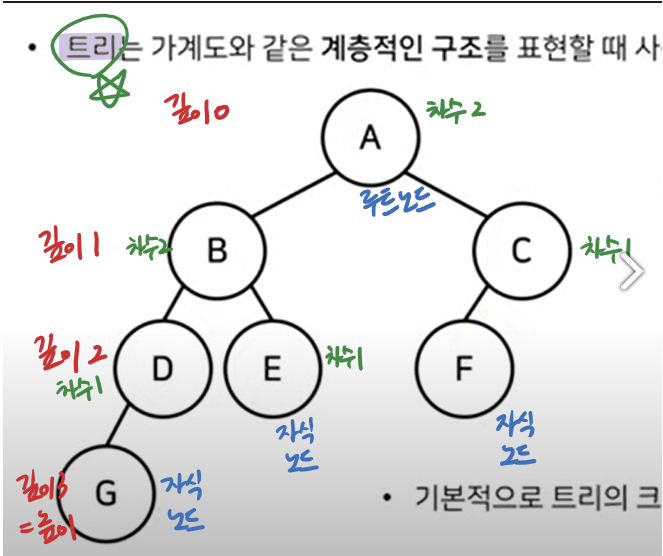
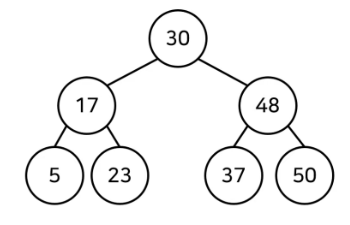
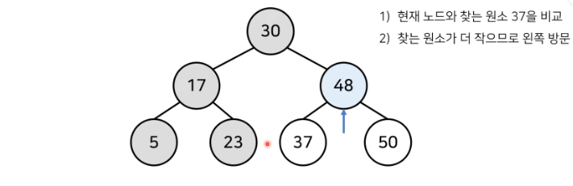

# 1. 범위를 반씩 좁혀가는 탐색
## 순차 탐색
- 순차 탐색: 리스트 안에 있는 특정한 데이터를 찾기 위해 앞에서부터 데이터를 하나씩 차례대로 확인하는 방법(정렬되지 않은 리스트에서 데이터를 찾아야 할 때 이용)
    - 이용 예시) 리스트에 특정 값의 원소가 있는지 체크할 때, count() 메서드

```py
def sequential_search(n, target, array):
    for i in range(n):
        if array[i] == target:
            return i + 1

print("생성할 원소 개수를 입력한 다음 한 칸 띄고 찾을 문자열을 입력하세요")
input_data = input().split()
n = int(input_data[0])
target = input_data[i]

print("앞서 적은 원소 개수만큼 문자열을 입력하세요. 구분은 띄어쓰기 한 칸으로 합니다.")
array = input().split()

print(sequential_search(n,target,array))
```

## 이진 탐색: 반으로 쪼개면서 탐색하기
- 이진 탐색: 배열 내부의 데이터가 정렬되어 있어야만 사용 가능. 탐색 범위를 절반씩 좁혀가며 데이터를 탐색하는 특징이 있다.
    - 이용하는 변수 3개: 시작점, 끝점, 중간점
    - 찾으려는 데이터와 중간점 위치에 있는 데이터를 반복적으로 비교
    - O(logN) -> 원소가 평균적으로 절반.
```py
# 재귀 함수로 구현한 이진 탐색 소스코드
def binary_search(array, target, start, end):
    if start > end:
        return None
    mid = (start + end) // 2 #int() 넣어도 같은 역할
    if array[mid] == target:
        return mid
    elif array[mid] > target:
        return binary_search(array, target, start, mid-1)
    else:
        return binary_search(array, target, mid + 1, end)

n, target = list(map(int, input().split()))
array = list(map(int, input().split()))

result = binary_search(array, target, 0, n-1)
if result == None:
    print("원소가 존재하지 않습니다")
else:
    print(result+1)
```

```py
# 이진 탐색 소스코드 구현
def binary_search(array, target, start, end):
    while start <= end:
        mid = (start + end) // 2
        if array[mid] == target:
            return mid
        elif array[mid] > target:
            end = mid - 1
        else:
            start = mid + 1
    return None

n, target = list(map(int, input().split()))
array = list(map(int, input().split()))

result = binary_search(array, target, 0, n-1)
if result == None:
    print("원소가 존재하지 않습니다")
else:
    print(result+1)
```
### 코딩 테스트에서의 이진 탐색
- 탐색 범위가 큰 상황에서의 탐색을 가정하는 문제가 많음
    - 탐색 범위가 2,000만을 넘어가면 이진 탐색으로 접근!
    - **1000만 단위 이상으로 넘어가면 이진 탐색과 같이 O(logN)의 속도를 내야하는 알고리즘을 떠올려야 문제를 풀 수 있는 경우가 많다는 점 기억!!**

## 트리 자료구조
- 트리 자료구조: 데이터가 정렬되어 있음.
    - 노드(정보의 단위로서 어떤 정보를 가지고 있는 개체)와 노드의 연결로 표현
    
    - 특징:<br>
    1. 트리는 부모 노드와 자식 노드의 관계로 표현
    2. 트리의 최상단 노드를 루트 노드라고 한다
    3. 트리의 최하단 노드를 단말 노드라고 한다
    4. 트리에서 일부를 떼어내도 트리 구조이며 이를 서브 트리라고 한다
    5. 트리는 파일 시스템과 같이 계층적이고 정렬된 데이터를 다루기에 적합하다

## 이진 탐색 트리
- 이진 탐색 트리: 이진 탐색이 동작 할 수 있도록 고안된, 효율적인 탐색이 가능한 자료구조



- 이진 탐색 트리의 특징:<br>
1. 부모 노드보다 왼쪽 자식 노드가 작다
2. 부모 노드보다 오른쪽 자식 노드가 크다<br>
=> "왼쪽 자식 노드 < 부모 노드 < 오른쪽 자식 노드"가 성립!



### 빠르게 입력받기
- 데이터의 개수가 1,000만 개를 넘어가거나 탐색 범위의 크기가 1,000억 이상이라면 이진 탐색 알고리즘을 의심!
    - 입력 데이터가 많을 때 -> sys 라이브러리의 readline() 함수를 이용!(입력시)
        - rstrip(): readline()으로 입력하면 입력 후 엔터가 줄 바꿈 기호로 입력됨. 이 공백 문자를 제거하는 역할

    ```py
    import sys
    input_data = sys.stdin.readline().rstrip()

    print(input_data)
    ```