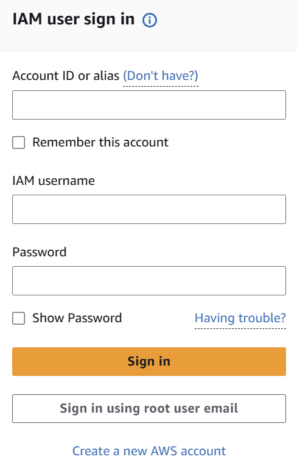
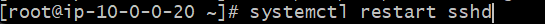

# 과제 설명
➡️주제: 클라우드 환겅 구성 (AWS Free tier 계정 활용)
1. 쿠버네티스 기반의 Elastic Kubernetes Service를 운영하기 전, AWS
클라우드 환경을 구축합니다.
2. 하나의 VPC에 이중화된 subnet을 구성한 후 Bastion host를 생성합
니다.
    1) AWS free tier 계정 생성
    2) AWS IAM 계정 생성과 MFA 설정
    3) VPC 구축
    4) Bastion host와 NAT instance 생성과 security group 설정

### 요구사항
1. Aws Free Tier 계정 생성
2. 본인이 사용할 IAM User 생성 후 MFA 설정(보안을 위해 Root 계정으로 로그인 금지)
    - 권한: AdministratorAccess
    - AWS Management Console 엑세스 유형 선택 후 비밀번호 재설정 필요 체크

# AWS 기초
### AWS란?
1. Amazon에서 개발한 클라우드 컴퓨팅 플랫폼
2. 네트워킹을 기반으로 가상 컴퓨터와 스토리지, 네트워크 인프라 등 다양한 서비스를 제공
3. 인프라(컴퓨팅, 네트워크, 스토리지 등), 플랫폼(DB, 분석, 배포관리) 등 다양한 서비스를 클라우드로 제공

### AWS에서 제공하는 서비스
1. 컴퓨팅 - EC2(Virtual machine), Lambda(Serveriess 컴퓨팅) 등
2. 네트워킹 - VPC, Route53, Direct Connect 등
3. 스토리지 - S3, EFS
4. 데이터베이스 - RDS, DynamoDB, ElastiCache 등
5. 관리도구 - CloudWatch, Config, Cloudtrail 등
6. 보안 - IAM, WAF&Shield, Certificate Manager 등

# 1. AWS IAM User 생성과 MFA 설정

### IAM이란?
1. IAM은 AWS 리소스에 대한 엑세스를 제어할 수 있는 AWS 서비스
2. AWS 리소스 사용 권한 부여와 제어
3. 보안상의 이유로 운영 환경에서 AWS root 계정 사용을 금지
4. 1인 1계정 생성하여 장애 발생 시 책임의 소재를 명확히 함
5. IAM 생성할 때만 root 계정 사용

### MFA란?
1. MFA는 사용자 이름과 암호 + OTP 인증 추가하여 로그인하는 서비스
2. 보안상 이유로 운영환경에서 IAM 개별 계정에 MFA 설정할 것 권고

## 1) 사용자 추가
1. root 계정 생성 (첫 회원가입!)
2. IAM 서비스 이동 후 사용자 추가

3. 로그아웃 후 IAM 계정으로 로그인

4. MFA 설정하기

# 2. VPC 구축
### VPC란?
1. 논리적으로 격리된 공간을 프로비저닝(=가상 네트워크 환경)
2. 하나의 계정에서 생성하는 리소스들만의 격리된 네트워크 환경 구성 가능

### VPC의 구성요소
1. VPC
2. Subnet
3. 라우트 테이블
4. 인터넷 게이트웨이

### VPC
1. 논리적인 독립 네트워크를 구성하는 리소스
2. CIDR(IP 범위를 지정하는 방식(VPC내의 자원들은 VPC의 CIDR 범위 안에서 ip를 할당받음))범위는 사설 ip 대역으로 설정(사설망 대역: 10.0.0.0/8, 172.16.0.0/12, 192.168.0.0./16)
3. 과제에서는 10.0.0.0/16로 설정

### Subnet
1. VPC를 CIDR 블록을 가지는 단위로 나누어 더 많은 네트워크 망을 만들 수 있음
2. 실제 리소스가 생성되는 물리적인 공간
3. VPC CIDR 블록 범위 안에서 지정 가능
4. 인터넷과 연결되어 있으면 public subnet, 아니면 private subnet
5. 과제에서는 다음과 같이 subnet 지정
    - Public subnet A: 10.0.0.0/24
    - Public subnet B: 10.0.1.0/24
    - Private subnet A: 10.0.2.0/24
    - Private subnet B: 10.0.3.0/24

> 🤔 멀티AZ 사용 이유  : 멀티 AZ란 하나 이상의 Availability Zone에 유사한 리소스를 동시에 배치하는 기능. AZ는 물리적 공간으로 분리되어 있기 때문에 이중화 구성하여 하나의 AZ에 장애가 발생하더라도 서비스에 문제X (추가 비용X)

### Route Table
1. Router - 목적지
2. Router Table - 목적지의 이정표
3. 데이터 요청 -> 라우터 -> 라우트 테이블에서 정의한 범위 내에서 목적지 찾음
4. External-rt: Public subnet의 라우트 테이블 / Internal-rt: Private Subnet의 라우트 테이블

### Internet Gateway
1. VPC는 격리된 네트워크 환경이기 때문에 VPC에서 생성된 리소스들은 인터넷 이용 불가
2. VPC와 인터넷을 연결해주는 관문
3. 목적지의 주소가 10.0.0.0/16에 매칭되는지 확인 후 없으면 인터넷 게이트웨이로 보냄

### NAT Gateway
1. Private Subnet이 인터넷과 통신하기 위한 아웃바운드 인스턴스
2. Private Subnet은 외부에서 요청하는 인바운드는 차단하더라도 아웃바운드 트래픽 허용 필요
3. Private Subnet에서 외부로 요청하는 아웃바운드 트래픽을 받아 Internet Gateway와 연결

## 2) VPC 구축

1. VPC 생성(Seoul region)

2. VPC 이름: mission-vpc / ipv4 CIDR 블록: 10.0.0.0/16 (나머지는 디폴트)
3. VPC 설정 편집 > DNS 호스트 이름 활성화(VPC 내부에서 생성되는 인스턴스에 public dns 호스트 네임 할당하는 기능)
4. Subnet 생성

5. Route Table 생성 -> 서브넷 연결 (public에 연결할지, private에 연결할지 주의!!!)

6. Internet Gateway 생성 -> VPC에 연결 -> Router Table에 추가(0.0.0.0/0)
    - 이름: mission-igw

# 3. Bastion Host(=NAT instance)
### Bastion Host
1. 내부와 외부 네트워크 사이에서 게이트 역할을 하는 Host
2. 외부에서 접근 가능하도록 Public IP 부여

### NAT instance
1. 비용 문제로 NAT Gateway 대신 NAT instance 이용! NAT instance를 Bastion Host로 이용

⭐인스턴스 = VM = EC2 다 같은말

### 인스턴스 보안그룹 설정
1. ssh 접속을 위한 22번 포트 오픈(내 컴퓨터만 들어갈 수 있도록! 22번 포트에 접근할 수 있는 유일한 건 우리 컴퓨터!! 22번은 외부포트는 공격이 많이 들어옴)

### OS 계정 생성과 비밀번호 로그인 허용
1. 보안상의 이유(이 인스턴스는 외부로 open 되어 있기에 조심해야함)로 운영 서버에서 ec2-user 사용 금지
    - ec2-user는 모든 Amazon Linux 인스턴스에 존재하는 "공용 계정"이므로 공격자들도 다 알고 있음.

    - 만약 비밀번호 로그인까지 허용하면 무차별 대입 공격(Brute force)에 취약해짐.
2. 개인 계정 ex)admin을 생성한 후 비밀번호를 생성하여 로그인할 때 id와 pw를 통해 접속(1인 1계정 사용 이유: 책임의 소재)
3. 보안상의 이유로 운영 서버에서 key 방식 로그인 지양
4. ssh 접속시 비밀번호 로그인 허용 설정

## 3) NAT instance 만들기
1. 인스턴스 생성

    - os 이미지 제공하고 있는 것 중 선택(여기선 NAT)
    - Public subnet에 연결
    - 보안 규칙 설정 (이 인스턴스에 아무나 접근해선 안됨.)

2. 해당 인스턴스에 대해 EIP(탄력적 ip 만들어야함 - 외부에서 접근 가능하도록)

3. private subnet의 라우팅 테이블에 연결 추가

✅ 키 페어(Key Pair)란?

- AWS EC2 인스턴스에 접속할 때 비밀번호 대신 사용하는 보안 인증 방식이야.
- 키 페어 = 공개 키(public key) + 개인 키(private key)
    - 공개 키는 AWS에 저장됨.
    - 개인 키(.pem이나 .ppk 파일)는 네가 가지고 있어야 함.
- EC2 접속 시 개인 키로만 문을 열 수 있음 → 열쇠 잃어버리면 인스턴스 접속 불가.

## 4) 원격 접속하기
1. git bash 접속
2. ssh -i mission-key.pem ec2-user@<퍼블릭IP또는DNS> 입력 (Amazon Linux 계열)
=> 근데 ip로 하면 접속 오류남..

### 계정 생성
1. admin 계정을 생성하여 비밀번호 부여

### Sudo 권한 부여
1. 생성한 admin 계정에 ec2-user와 동일하게 sudo 권한 부여하고 비밀번호 입력 없이 명령어 수행 가능하게 생성

> 🤔Vi editor?   1. 리눅스에서 사용하는 문서편집기   2. 명령모드 - 처음 vi 명령어로 vi를 열면 명령모드로 진입. 방향키를 이용하여 커서를 이동 가능. "dd" 한 줄 삭제, "yy" 한 줄 붙여넣기, "x" 명령어로 글자 하나를 삭제   3. 입력모드 - 명령모드에서 "i"나 "a" 명령을 통해서 입력 모드로 변경 코드나 글을 작성 가능. 명령 모드로 다시 돌아오려면 입력 "ESC"   4. 마지막 행 모드(Last line mode) - 명령모드에서 ":" (콜론)을 입력 후 저장(wq), 종료(q, q!) 입력   5. 복사: 드래그   6. / 검색어 입력

### 비밀번호 로그인 설정
1. 키 방식 로그인 차단, 비밀번호 로그인 허용

 => sshd 데몬 재시작

# 최종 아키텍쳐
