# 1. 가장 빠른 길 찾기
## 가장 빠르게 도달하는 방법
- 최단 경로: 가장 짧은 경로를 찾는 알고리즘.
    - 유형 예시
        - 한 지점에서 다른 특정 지점까지의 최단 경로를 구해야 하는 경우
        - 모든 지점에서 다른 모든 지점까지의 최단 경로를 모두 구해야 하는 경우
    - 그래프 이용해 표현
        - 노드: 각 지점
        - 간선: 지점 간 연결된 도로
    - 대표 알고리즘
        1. 다익스트라 최단 경로 알고리즘
        2. 플로이드 워셜
        3. 벨만 포드
    
## 다익스트라 최단 경로 알고리즘
> ⭐키 포인트<br> - 최단 거리를 가지는 노드를 하나씩 반복적으로 선택 -> 해당 노드를 거쳐 가는 경로 확인 -> 최단 거리 테이블 갱신


- 여러 개의 노드가 있을 때, 특정한 노드에서 출발하여 다른 노드로 가는 각각의 최단 경로를 구해주는 알고리즘.
- '음의 간선'이 없을 때 정상 작동.
- 특징:<br>
    1) '각 노드에 대한 현재까지의 최단 거리' 정보를 항상 1차원 리스트(최단 거리 테이블)에 저장하며 리스트 계속 갱신.
    2) 매번 현재 처리하고 있는 노드를 기준으로 주변 간선 확인.
    3) '방문하지 않은 노드 중에서 현재 최단 거리가 가장 짧은 노드를 확인'해 그 노드에 대하여 아래의 4번 과정을 수행 -> 그리디!

    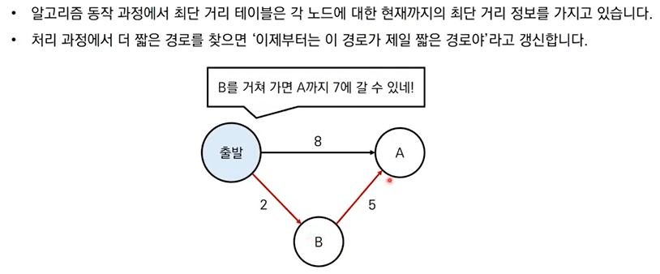

- 구현 방법:<br>
    방법 1. 구현하기 쉽지만 느리게 동작하는 코드
    ⭐방법 2. 구현하기에 조금 더 까다롭지만 빠르게 동작하는 코드

⭐그리디 알고리즘! -> 매번 '가장 비용이 적은 노드'를 선택해서 임의의 과정 반복.

1. 출발 노드를 설정
2. 최단 거리 테이블을 초기화
3. 방문하지 않은 노드 중에서 최단 거리가 가장 짧은 노드 선택
4. 해당 노드를 거쳐 다른 노드로 가는 비용을 계산하여 최단 거리 테이블을 갱신
5. 위 과정에서 3과 4번을 반복

### 동작 원리

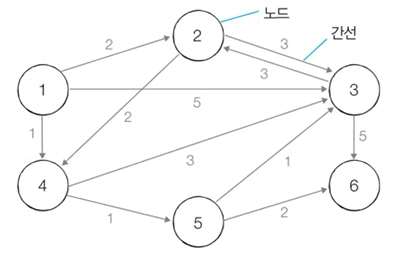

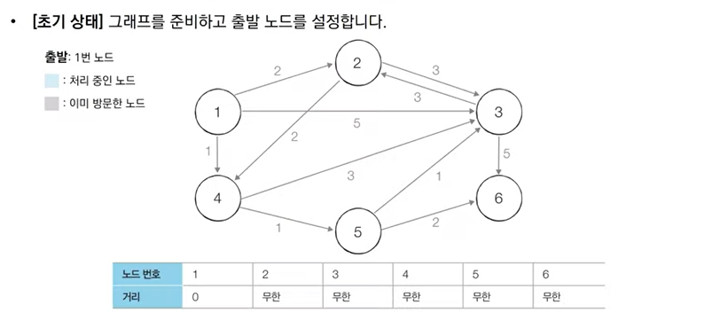
- 출발 노드까지의 거리가 0이고, 다른 모든 노드에 대해서는 거리가 무한인 것으로 초기화할 수 있다.

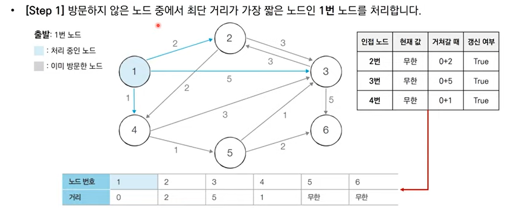
- 1번 노드에서 2번 노드로 거쳐갈 때, 현재 값인 무한보다 2가 더 작기 때문에 2로 갱신한다. → 최단 거리 값이 2로 바뀐 것을 확인할 수 있다.
- 마찬가지로 3번, 4번 노드에 대해서 동일한 로직으로 갱신한다.

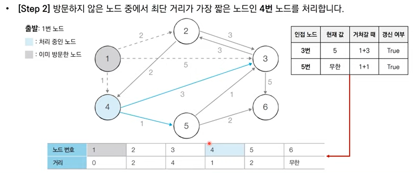
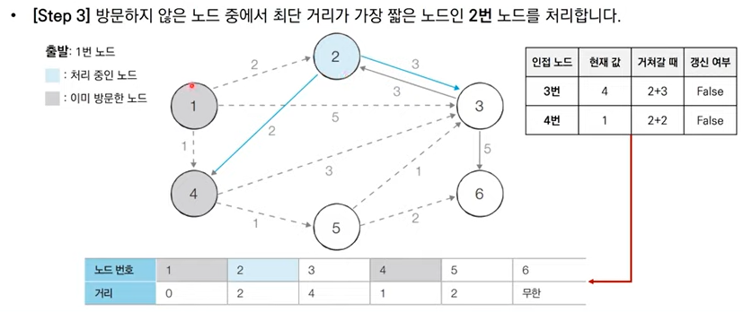
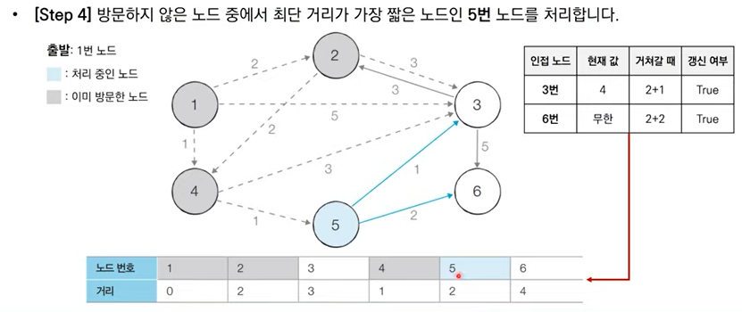
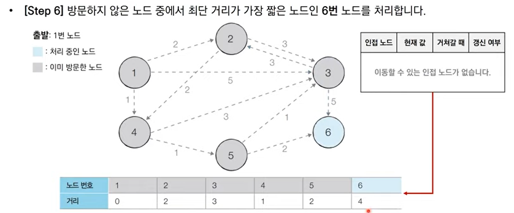

=> '방문하지 않은 노드 중에서 가장 최단 거리가 짧은 노드를 선택'하는 과정을 반복하는데, 이렇게 선택된 노드는 '최단 거리'가 완전히 선택된 노드이므로, 더 이상 알고리즘을 반복해도 최단 거리가 줄어들지X<br>

⭐한 단계당 하나의 노드에 대한 최단 거리를 확실히 찾는 것! (그래서 사실 마지막 남은 노드는 자동 고정)

### 방법 1. 간단한 다익스트라 알고리즘
- 시간 복잡도: O(V^2) 
    - V: node의 갯수<br>
    => 노드의 개수가 10000개를 넘어가면 '개선된 다익스트라 알고리즘'을 이용해야함<br>
    => O(v)번에 걸쳐서 최단 거리가 가장 짧은 노드를 매번 선형 탐색 / O(V)에 걸쳐 연결된 노드 매번 확인

1. 각 노드에 대한 최단 거리를 담는 1차원 리스트 선언
2. 단계마다 '방문하지 않은 노드 중에서 최단 거리가 가장 짧은 노드를 선택'하기 위해 매 단계마다 1차원 리스트의 모든 원소를 확인

🔖참고: 입력되는 데이터의 수가 많다는 가정하에 파이썬 내장 함수인 input()을 더 빠르게 동작하는 sys.std.realine()으로 치환.<br>
🔖참고2: 리스트는 (노드의 개수 + 1)의 크기로 할당하여, 노드의 번호를 인덱스로 하여 바로 리스트에 접근할 수 있도록 했다.

```py
import sys
input = sys.stdin.readline
INF = int(1e9) #무한을 의미하는 값

# 노드의 개수, 간선의 개수
n, m = map(int, input().split())
start = int(input())
graph = [[] for i in range(n+1)]
visited = [False] * (n + 1)
distance = [INF] * (n + 1)

# 모든 간선 정보를 입력 받기
for _ in range(m):
    a, b, c = map(int, input().split())
    # a -> b로 가는 비용이 c
    graph[a].append((b,c))

# 방문하지 않은 노드 중에서, 가장 최단 거리가 짧은 노드의 번호를 반환
def get_smallest_node():
    min_value = INF
    index = 0
    for i in range(1, n+1):
        if distance[i] < min_value and not visited[i]:
            min_value = distance[i]
            index = i
    return index

def dijkstra(start):
    # 시작 노드에 대해서 초기화
    distance[start] = 0
    visited[start] = True
    for j in graph[start]:
        distance[j[0]] = j[1]
    # 시작 노드를 제외한 전체 n-1개의 노드에 대해 반복
    for i in range(n-1):
        now = get_smallest_node()
        visited[now] = True
        # 현재 노드와 연결된 다른 노드를 확인
        for j in graph[now]:
            cost = distance[now] + j[1]
            # 현재 노드를 거쳐서 다른 노드로 이동하는 거리가 더 짧을 때
            if cost < distance[j[0]]:
                distance[j[0]] = cost

dijkstra(start)

for i in range(1, n+1):
    if distance[i] == INF:
        print("INFINITY")
    else:
        print(distance[i])
```

### 방법 2. 개선된 다익스트라 알고리즘.
- 시간 복잡도: O(ElogV)
    - V: 노드의 개수
    - E: 간선의 개수<br>

⭐최단 거리가 가장 짧은 노드를 선형적으로 찾지 말자<br>
⭐현재 가장 가까운 노드를 저장하기 위한 목적으로만 우선순위 큐 이용
- heap 자료 구조 이용!
    - heap에서의 탐색 시간: logN

> **💡힙 설명**
- 우선순위 큐를 구현하기 위해 사용됨.
    - 우선순위 큐: 우선순위가 가장 높은 데이터를 가장 먼저 삭제
    - 대부분 우선순위 큐 라이브러리 지원.
        - python: PriorityQueue or heapq(더 빠름) / 최소 힙이 디폴트(최대 힙 쓰고 싶으면 - 넣었다가 나중에 빼기)
    - 우선순위 값을 표현할 때는 일반적으로 정수형 자료형의 변수가 이용.
        - 첫 번째 원소를 기준으로 우선순위 설정.

|우선순위 큐 구현 방식|삽입 시간|삭제 시간|
|---|---|---|
|리스트|O(1)|O(N)|
|힙|O(logN)|O(logN)|

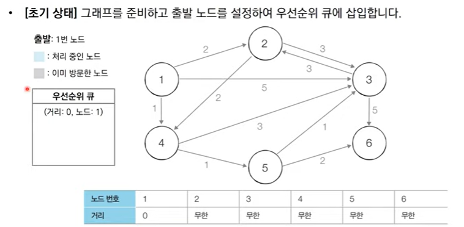
- 출발 노드를 '1번'이라고 가정한다. '1번' 노드까지의 현재 최단 거리 값을 0으로 설정해서 우선순위 큐에 넣는다.
- 우선순위 큐에 데이터를 넣을 때 튜플 형태로 데이터를 묶는 과정에서 첫번째 원소를 거리로 설정하게 되면 이 거리를 기준으로 해서 더 거리가 작은 원소가 먼저 나올 수 있도록 큐가 구성된다.

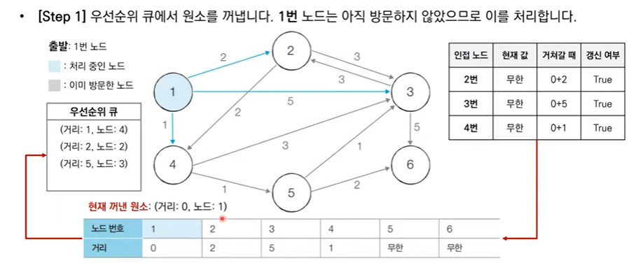
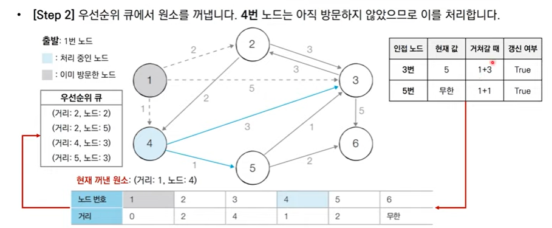

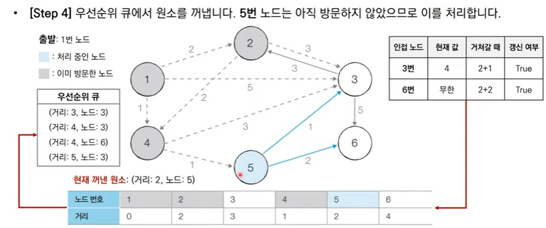
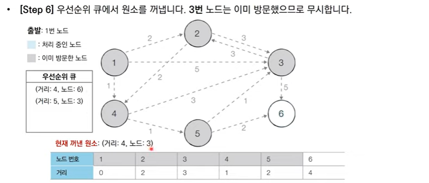
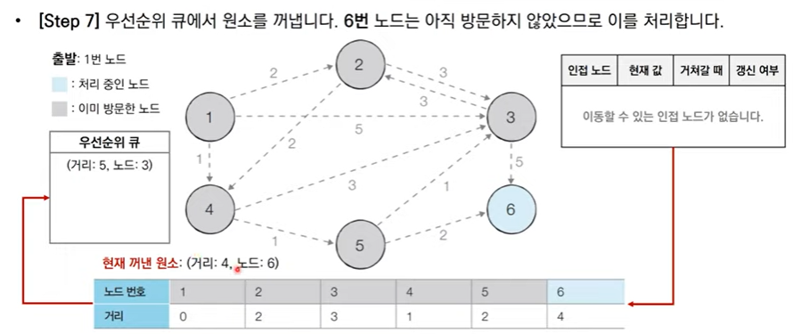

```py
import heapq
import sys
input = sys.stdin.readline
INF = int(1e9)

n, m = map(int, input().split())
start = int(input())
graph = [[] for i in range(n+1)]
distance = [INF] * (n+1)

for _ in range(m):
    a, b, c = map(int, input().split())
    graph[a].append((b,c))

def dijkstra(start):
    q = []
    heapq.heappush(q, (0, start))
    distance[start] = 0
    while q:
        dist, now = heapq.heappop(q)
        if distance[now] < dist:
            continue
        for i in graph[now]:
            cost = dist + i[1]
            if cost < distance[i[0]]:
                distance[i[0]] = cost
                heapq.heqppush(q, (cost, i[0]))

dijkstra(start)

for i in range(1, n+1):
    if distance[i] == INF:
        print("INFINITY")
    else:
        print(distance[i])
```

## 플로이드 워셜 알고리즘
- 모든 지점에서 다른 모든 지점까지의 최단 경로.
- 다익스트라와의 차이
    - '거쳐 가는 노드'를 기준으로 알고리즘 수행(매번 방문하지 않은 노드 중에서 최단 거리를 갖는 노드 찾을 필요X)
        - ex) 1번 노드에 대해 확인할 때는 1번 노드를 중간에 거쳐 지나가는 모든 경우 고려!
    - 2차원 리스트에 '최단 거리' 정보 저장(이래서 O(N^2))
    - 다이나믹 프로그래밍!!!(N번 만큼의 단계를 반복하며 '점화식에 맞게' 2차원 리스트를 갱신하기 때문.)
- 시간 복잡도
    - N번의 단계 수행 / 단계마다 O(N^2)의 연산 -> 남은 노드 n-1개 중 순서 고려해 2개 뽑으니 N^2<br>
    => 총시간 복잡도: O(N^3)

> 점화식: Dab = min(Dab, Dak + Dkb)

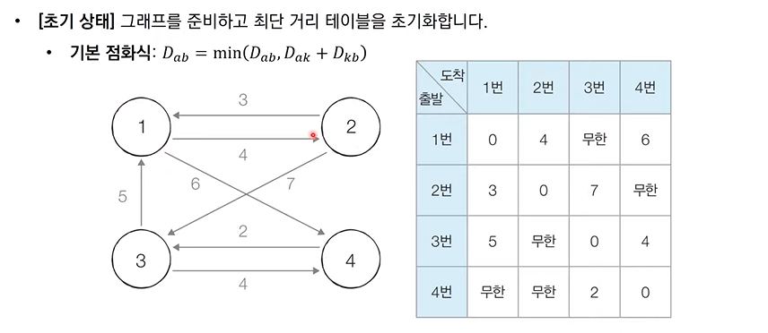

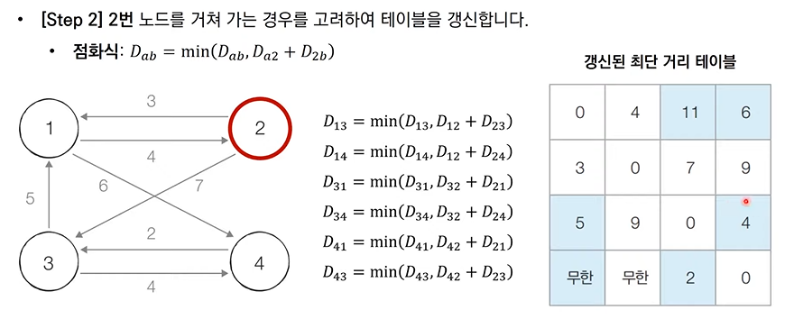
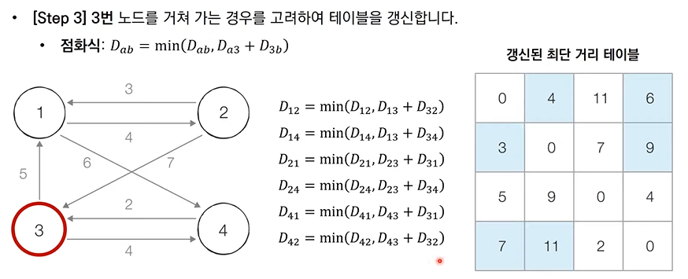
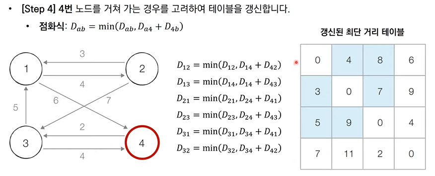

```py
INF = int(1e9)

n = int(input())
m = int(input())
graph = [[INF] * (n+1) for _ in range(n+1)]

for a in range(1, n+1):
    for b in range(1, n+1):
        if a==b:
            graph[a][b] = 0

for _ in range(m):
    a, b, c = map(int, input().split())
    graph[a][b] = c

for k in range(1, n+1):
    for a in range(1, n+1):
        for b in range(1, n+1):
            graph[a][b] = min(graph[a][b], graph[a][k] + graph[k][b])

for a in range(1, n+1):
    for b in range(1, n+1):
        if graph[a][b] == INF:
            print("INFINITY", end = " ")
        else:
            print(graph[a][b], end = " ")
    print()
```