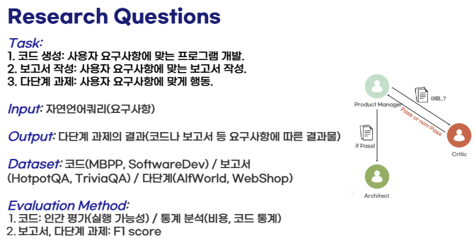
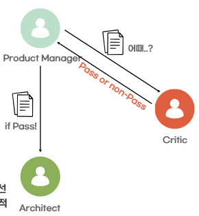

이 섹션에는 학부 4학년때 들은 "자연언어학습" 과목에서 수행한 중간 프로젝트 과정을 정리하여 기록하겠다.<br>
우리 조는 다음과 같은 과제를 프로젝트의 주제로 삼았다.
# 프로젝트 주제 설명


### 기존 연구
1. Critic
    - 상호작용을 통한 자가 수정 능력에 집중한 프레임워크
    - 문제 해결을 위해 외부 도구 사용
    - 발견된 Error에 Critique 생성 후 결과물 수정
2. MetaGPT
    - LLM 기반 협업 에이전트 프레임워크
    - 표준 운영 절차(SOP)에 따른 여러 전문성을 가진 에이전트들의 협업

### 기존 연구의 한계
- 미시적인 CRITIC
- 느린 검증 타이밍<br>
=> 두 논문의 장점만 합치면 어떨까?

### Research Question
Q1. 각 단계별 검증(CRITIC)을 추가하는 것이 최종 결과물의 품질에 얼마나 기여하며, 그에 따른 비용 증가는 어느 정도인가?

Q2. 범용적인 역할군 설계를 통해, 소프트웨어 개발을 넘어선 일반적인 문제 해결(예: 리서치, 보고서 작성) 에도 효과적으로 적용 가능한 프레임워크를 만들 수 있는가?

# 베이스라인 (우리가 새로 제안한 구조와 비교할 모델)
- MetaGPT
- Critic

# 개발환경 구축
## MetaGPT 구현
우선적으로 MetaGPT를 로컬에서 실행가능하도록 구현해보기로 했다.<br>
[github for MetaGPT](https://github.com/FoundationAgents/MetaGPT?tab=readme-ov-file) <- Github 링크.

### 1. local에 폴더 만들기
### 2. 해당 폴더내에 repo 복제하기
```bash
git clone https://github.com/FoundationAgents/MetaGPT.git
cd MetaGPT
```
### 3. 가상환경 구축하기(in anaconda prompt) + 실행하기
```bash
conda create -n metagpt-dev
conda activate metagpt-dev
```

### 4. 패키지 의존성 설치 (editable)
```bash
pip install -U -e .
```
- -e (editable): 소스 폴더를 “개발 모드”로 설치해.<br>
    → 패키지 파일을 수정하면 재설치 없이 곧바로 변경 내용이 반영돼(개발 편리).

- -U (upgrade): 이미 깔려 있으면 가능한 최신으로 업데이트해서 설치.

- .: 현재 디렉토리(지금 이 setup.py가 있는 프로젝트)를 설치한다는 뜻.
- 무엇이 설치되나?
    1. metagpt/ 아래의 파이썬 모듈 전체
    2. requirements.txt에 적힌 필수 의존성 패키지(install_requires=requirements)
    3. 콘솔 명령어 metagpt (엔트리포인트: metagpt.software_company:app)
    4. include_package_data=True로 지정된 패키지 데이터 파일들(있다면)
- 조금더 풀어서...
    - pip install -e . 은 배포 이름 **metagpt**를 개발 모드로 설치해요.
    - 설치되는 범위는 setup.py의 아래 코드에서 찾은 패키지 디렉터리들(보통 metagpt/와 그 하위 서브패키지들)입니다.
    ```python
    packages = find_packages(exclude=["contrib", "docs", "examples", "tests*"])
    ```
    - “패키지 디렉터리”란 __init__.py가 들어있는 폴더를 말해요.<br>
    → 즉, metagpt/ 아래라도 __init__.py가 없는 폴더는 패키지로 인식되지 않아 설치 대상이 아님.
    - 추가로 entry_points 덕분에 CLI 명령 metagpt(= metagpt.software_company:app)가 생깁니다.

> ⭐정리("pip install -U -e의 동작 과정)<br>

어떻게 동작하냐면…
1. pyproject.toml이 있는 경우 (PEP 517/518/660)
    - pip은 먼저 pyproject.toml을 읽어 빌드 백엔드(예: setuptools.build_meta)를 확인해.
    - Editable(-e) 설치를 지원하면(Pep 660) 그 방식으로 설치하고, 이때는 전통적인 python setup.py develop을 직접 돌리지 않아.
    - 그래도 내부적으로는 결국 setuptools가 setup.cfg/setup.py의 메타데이터(패키지, 의존성, 엔트리포인트 등)를 읽어 설치 과정을 수행.
2. pyproject.toml이 없는 경우 (레거시 setuptools)
    - pip install -e . → 사실상 **python setup.py develop**을 호출해 개발 모드로 링크 설치해.
    - 이때 setup.py의 setup() 설정, find_packages, install_requires 등이 사용됨.<br>
=> 이 리포지토리에서 pip install -U -e .를 실행하면, setuptools가 setup.py의 setup(...) 메타데이터를 읽고 설치 과정을 수행합니다. “다운로드”되는 건 의존 패키지들이고, 메인 소스(metagpt/)는 복사하지 않고 개발 모드(링크)로 연결돼요.

### 5. 설정 파일 만들기
```bash
metagpt --init-config
```
- metagpt --init-config 를 실행하면 내 홈폴더에 ~/.metagpt/config2.yaml 이라는 기본 설정 파일을 자동 생성합니다.
- 이후에 이 파일을 열어 API 키·모델명·폴더 경로 같은 걸 내 환경에 맞게 수정해요.
- MetaGPT는 실행될 때 이 설정을 읽어 어떤 모델을 쓰고, 어디에 결과를 저장하고, 로그/프록시/동시성 등을 어떻게 할지를 결정합니다.
- 보통 들어있는(또는 넣어야 하는) 것들:
    - API 키: OpenAI, GitHub 등(필요한 경우).
    - 모델/프롬프트 설정: 사용할 모델 이름, 온도 등.
    - 작업/출력 경로: 코드 생성·캐시·로그 저장 폴더.
    - 네트워크 옵션: 프록시, 타임아웃.
    - 병렬/리소스: 동시 작업 개수, 스레드/프로세스 제한.
    - 기타 통합: Git 설정, 토큰 한도 등.
- 왜 필요하냐?
    - 매번 옵션을 커맨드라인에 길게 쓰지 않고, 한 번만 세팅해두고 계속 재사용하려고.
    - 팀/머신이 달라도 같은 동작을 재현(경로·버전·모델 고정)하려고.